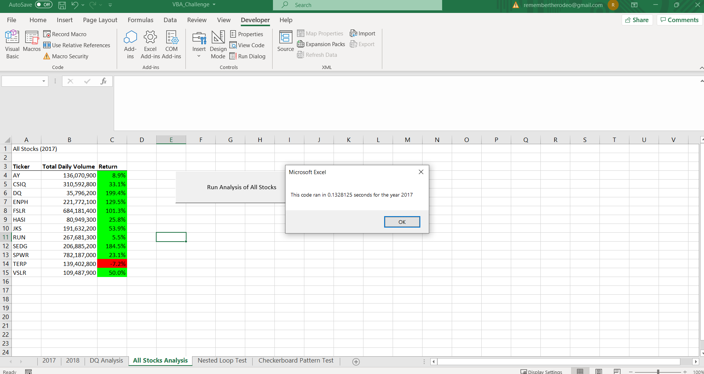
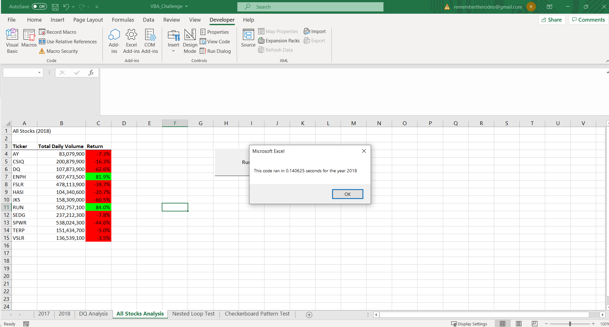

# stocks-analysis
Module 2
# Analyzing Stocks with VBA
## Overview of Project
This project is a VBA analysis of stocks data across 12 different Green Companies. The analysis is conducted on spreadsheets of Green Company stock data for years 2017 and 2018, each encompassing 3012 rows excluding the header. For each company during each year, VBA code is written to report the total volume of stock trades and the return on investment, or percent change in the stock's value for that year. The VBA code was originally written with a nested for loop using an array of the 12 different Green Companies before it was refactored for improved performance with a new index variable and all values reported from arrays.
### Purpose
The purpose of this project is to generate working VBA code for stocks analysis of data in excel. Additionally, the purpose of this project is to seek advantages and disadvantages for different VBA coding methods in this data analysis. The methods compared are: 1) an array of stock company data ran through a for loop with nested for loop and 2) a for loop indexed with a variable through four different arrays (three of which were non-array variables in the first method). To compare the methods, the code execution times are recorded.
### Background
VBA, or Visual Basic for Application, is a programming language extention integrated with the microsoft office suite (https://corporatefinanceinstitute.com/resources/excel/study/vba-in-excel/). It is useful for automating key procedures and processes in order to increase efficiency (https://corporatefinanceinstitute.com/resources/excel/study/vba-in-excel/). Additionally, VBA provides access to functions beyond what is available in Microsoft Office applications (https://corporatefinanceinstitute.com/resources/excel/study/vba-in-excel/). In finance, VBA is an invaluable tool used to manipulate large amounts of data for streamlined reports and data visualizations (https://www.investopedia.com/terms/v/visual-basic-for-applications-vba.asp).
## Results
Figure 1: Original code execution runtime for 2017
.png)
Figure 2: Refactored code execution runtime for 2017

Figure 3: Original code execution runtime for 2018
.png)
Figure 4: Refactored code execution runtime for 2018

Using (refactored code execution time - original code execution time) / original code execution time * 100, we find an 84% faster execution for 2017 stocks analysis and 83% faster execution for 2018 stocks analysis with the same outputs.
## Summary
### Refactoring Code
An advantage to refactoring code is to make the code more efficient. In this case and in general, an example of more efficient code is reduced code execution runtime. A disadvantage is that it can be difficult and time consuming to research the refactored code. The original output must remain the same while changing the written code in the process of refactoring.
### Original and Refactored Code
In this case, refactoring the code provided reduced code execution runtime detailed in the Results section. The advantage of the original code is that it is simple to write and read. There is a single array of tickers for the 12 different stock companies, and the total volumes of stock trades, starting stock prices, and ending stock prices are treated as Long, Double, and Double variables respectively. This is fine considering that our data sheets consisted of only 3012 rows where original code execution runtime is less than a second, but if we were to introduce significantly more stock companies in our data sheets to analyze all green company stocks, the original code execution runtime could prove to be a hindering disadvantage. The advantage to the refactored code is a greatly reduced code execution runtime which could prove to handle much larger datasheets to include much more companies in our stocks analysis. The disadvantage of this refactored code is that it was more challenging to read and write with total volumes of stock trades, starting stock prices, and ending stop prices treated as arrays, and an introduced index to refer to these arrays while incrementing throughout the loop in our code. 
